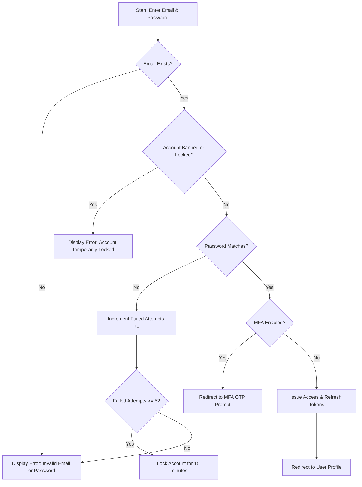

# 🔑 Login Flow Specification

## 🎯 1. Business Objective & Scope
The Login feature enables registered users to authenticate using their primary Email and Password. Upon successful verification, the system issues authentication tokens required to access features in the [User Management Module](/docs/user).

---

## 👤 2. Actors
- **End User (Member)**: Standard registered application user.
- **System Administrator**: Elevated operational user.

---

## 📋 3. User Stories & Acceptance Criteria

### User Story US-AUTH-01: Standard Login
> **As an** Application User,  
> **I want to** log in with my Email and Password,  
> **So that** I can access my account Dashboard and manage my [User Profile](/docs/user/profile-management).

#### Acceptance Criteria (AC):
1. **Valid Credentials**: Inputting correct Email + Password authenticates the user, stores JWT Tokens, and redirects to the main Dashboard.
2. **MFA Enforced**: If Multi-Factor Authentication is enabled, redirect to the [MFA Verification Screen](/docs/auth/login-flow/mfa).
3. **Account Lockout**: 5 consecutive incorrect password attempts trigger a 15-minute lockout per [Account Lockout Rules](/docs/user/rbac-permissions/user-lifecycle).

---

## 🔄 4. Business Process Flow (Mermaid)

---

## 🔗 5. Cross-Module References

- 🛡️ **MFA Challenge**: For accounts with 2FA enabled, see [MFA Specification](/docs/auth/login-flow/mfa).
- 🔑 **Token Management**: Token structure and expiration rules are detailed in [Session & Token Management](/docs/auth/oauth-sso/session-management).
- 👤 **Post-Login Target**: Default post-login destination is the [User Profile Page](/docs/user/profile-management).
- ⛔ **Lockout Handling**: Account suspension details are in [Account Lifecycle & Lockout](/docs/user/rbac-permissions/user-lifecycle).
