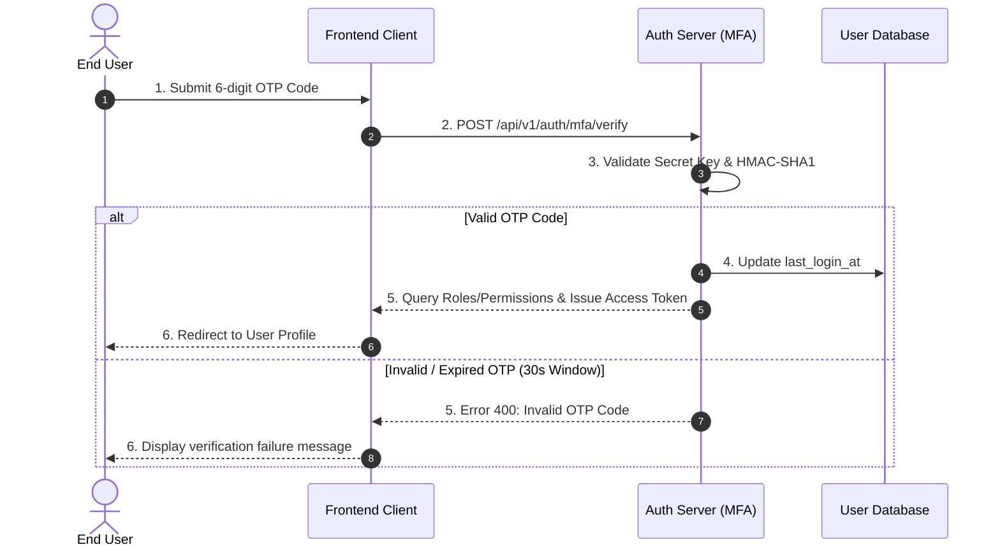

# 🛡️ Multi-Factor Authentication (MFA)

## 🎯 1. Business Objective
MFA introduces a secondary security barrier requiring a 6-digit TOTP code generated by an Authenticator app (or SMS/Email) after passing the primary [Email & Password Login Flow](/docs/auth/login-flow).

---

## 🛠️ 2. Enrollment & Setup Workflow

1. **Enrollment**: Users initiate setup inside [Account Security Settings](/docs/user/profile-management/account-settings) by scanning a QR code to generate a shared secret key (TOTP).
2. **Verification**: Entering a valid 6-digit code confirms successful setup.
3. **Backup Codes**: System generates 8 single-use emergency recovery codes for account retrieval if the device is lost.

---

## 🔄 3. Authentication Sequence

---

## 🔗 4. Related References

- 🔙 **Primary Login**: [Standard Login Flow](/docs/auth/login-flow).
- ⚙️ **Enable/Disable MFA**: Configure 2FA preferences in [Account Settings](/docs/user/profile-management/account-settings).
- 🔑 **Session Issuance**: Learn token details in [Session Management](/docs/auth/oauth-sso/session-management).
