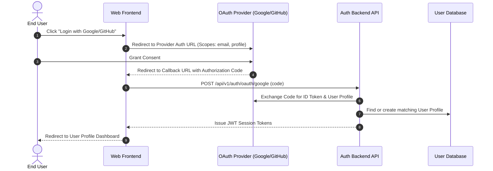

# 🌐 Social Single Sign-On (OAuth 2.0 / SSO)

## 🎯 1. Feature Overview
Allows users to authenticate seamlessly using their existing **Google Workspace** or **GitHub** accounts without creating a manual password.

---

## 📌 2. Account Mapping Rules

1. **Automatic Email Matching**: If the returned identity email matches an existing email in [User Profile Management](/docs/user/profile-management), automatically link the OAuth provider identity to that existing User ID.
2. **Auto Profile Provisioning**: If the email does not exist, provision a new user profile with default avatar and full name per [Profile Creation Rules](/docs/user/profile-management).
3. **Default Role Assignment**: Newly created OAuth accounts receive the `MEMBER` role according to [RBAC Policy](/docs/user/rbac-permissions).

---

## 🔄 3. OAuth 2.0 Callback Flow

---

## 🔗 4. Cross-Module Connections

- 👤 **Profile Syncing**: After SSO login, manage profile attributes in [User Profile Management](/docs/user/profile-management).
- 🔑 **Token Lifecycles**: For token issuance details, see [Session & Token Management](/docs/auth/oauth-sso/session-management).
- 🔐 **Alternative Authentication**: Compare with standard [Email/Password Login](/docs/auth/login-flow).
