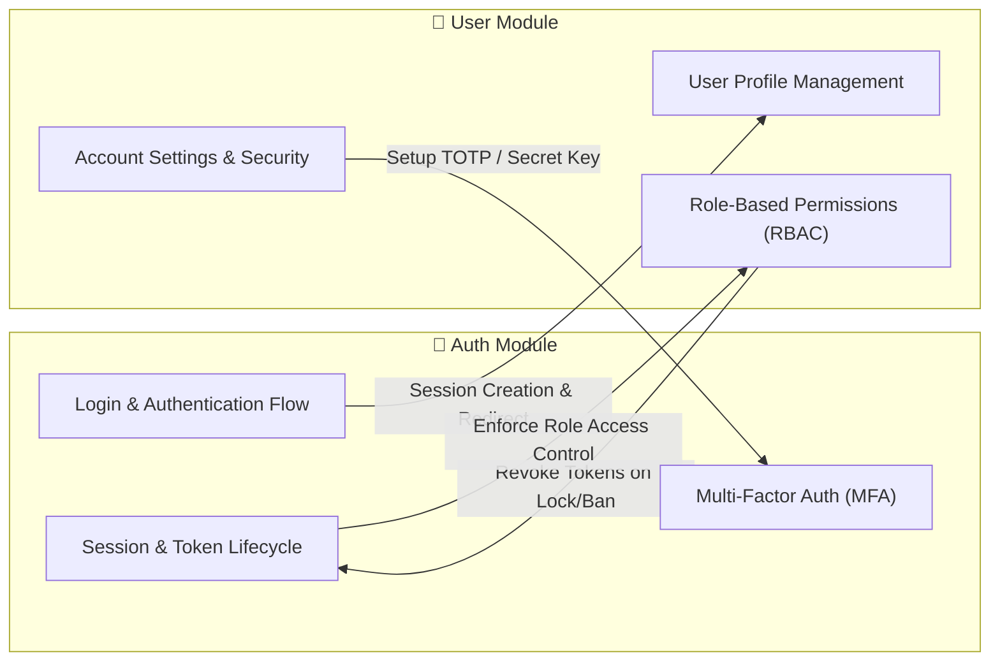

# 📚 System Business Analysis (BA) Documentation

Welcome to the technical business requirements documentation portal. This documentation is authored for **Product Owners, Business Analysts, Tech Leads, and Software Developers** to understand business rules, process workflows, and API specifications across system features.

---

## 🚀 Key Functional Modules

<Cards>
  <Card title="🔐 1. Authentication Module (Auth)" href="/docs/auth">
    Includes Login & Registration flows, Multi-Factor Authentication (MFA/OTP), OAuth 2.0 (Google, GitHub), and Session Management (JWT Tokens).
  </Card>

  <Card title="👤 2. User Management Module (User)" href="/docs/user">
    Includes User Profile management, Account Security settings, Role-Based Access Control (RBAC), and User Account Lifecycle management.
  </Card>
</Cards>

---

## 🔗 Cross-Module Interaction Map

Below is the high-level interaction diagram between the **Auth** module and the **User** module:

---

## 📌 Quick Reference Guide

1. **Authentication & OTP**: Explore [Login Flow & Session Creation](/docs/auth/login-flow) and [Multi-Factor Authentication (MFA)](/docs/auth/login-flow/mfa).
2. **Access Control & Lifecycle**: Refer to [Role-Based Access Control (RBAC)](/docs/user/rbac-permissions) and [Account Lifecycle & Lock Rules](/docs/user/rbac-permissions/user-lifecycle).
3. **Social Login Setup**: Check out [Google & GitHub OAuth 2.0 Integration](/docs/auth/oauth-sso/google-github).
