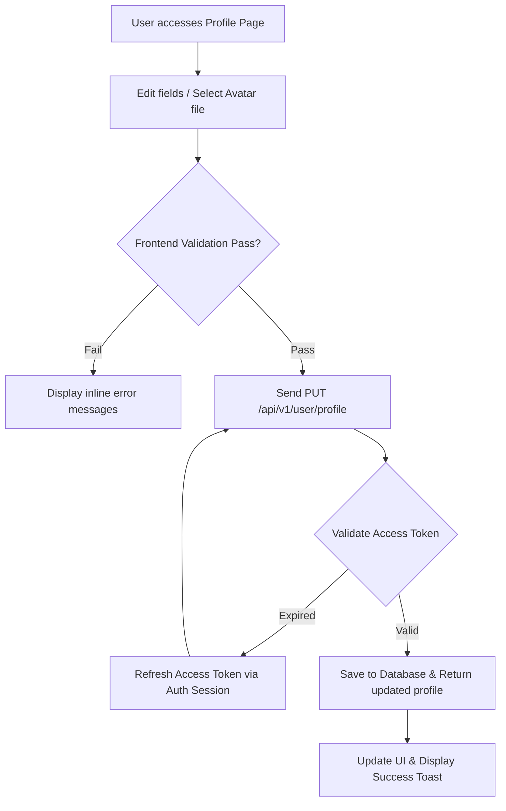

# 📝 User Profile Management

## 🎯 1. Business Objective
The User Profile feature allows users to inspect and update their identity data, upload a profile picture, and maintain up-to-date contact information.

---

## 📋 2. Field Specifications & Validation Rules

| Field Name | Data Type | Required | Business Validation Rules |
| :--- | :--- | :--- | :--- |
| **Full Name** | String (1-100) | Yes | Stripped of malicious HTML / XSS scripts |
| **Email** | String (Email) | Yes | Read-only (Email changes require Auth re-verification) |
| **Phone Number** | String (10-11) | No | Valid international format or local standard |
| **Avatar URL** | Image File | No | Formats: PNG/JPG/WebP, max file size 5MB |
| **Bio / Notes** | Text | No | Maximum 500 characters |

---

## 🔄 3. Profile Update Workflow (Mermaid)

---

## 🔗 4. Related References

- 🛡️ **Account Security**: Change passwords or manage MFA in [Account Security & Settings](/docs/user/profile-management/account-settings).
- 🔑 **Identity Source**: Primary email address is synchronized from [Email Login](/docs/auth/login-flow) or [Social OAuth](/docs/auth/oauth-sso/google-github).
- 👑 **Field Visibility**: Specific profile fields depend on assigned roles in [RBAC Permissions](/docs/user/rbac-permissions).
