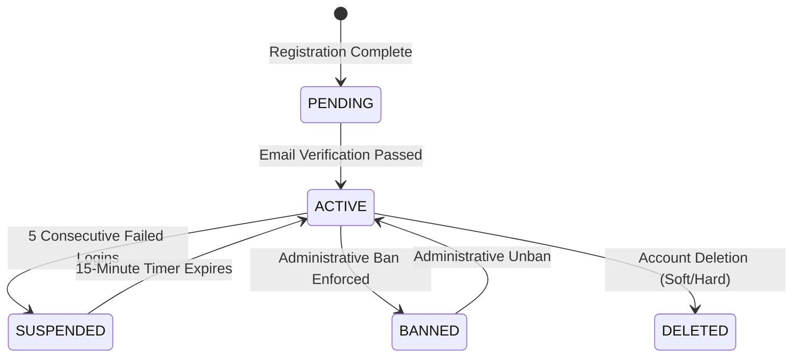

# 🔄 Account Lifecycle & Lockout Rules

## 🎯 1. Account State Machine

- **PENDING**: Newly registered user awaiting email confirmation.
- **ACTIVE**: Fully functional account with active platform access.
- **SUSPENDED**: Temporarily locked system-wide (e.g., failed password attempts in [Login Flow](/docs/auth/login-flow)).
- **BANNED**: Manually restricted by an Admin due to policy violation per [RBAC Permissions](/docs/user/rbac-permissions).
- **DELETED**: Soft-deleted or permanently purged user record.

---

## 🛑 2. System Effects of BANNED Status

When an account enters the `BANNED` state:
1. All API endpoints immediately respond with `403 Forbidden (User account is banned)`.
2. All active Refresh Tokens & Access Tokens are purged in [Auth Session Management](/docs/auth/oauth-sso/session-management).
3. The user cannot log in via [Email Login](/docs/auth/login-flow) or [OAuth SSO](/docs/auth/oauth-sso/google-github).

---

## 🔗 3. Related References

- 🔐 **Automated Suspensions**: Trigger rules are defined in [Login Flow](/docs/auth/login-flow).
- 👑 **Administrative Privileges**: Check which roles can ban users in [RBAC Permissions](/docs/user/rbac-permissions).
- ⏳ **Session Purging**: Technical details on revoking tokens in [Session Management](/docs/auth/oauth-sso/session-management).
