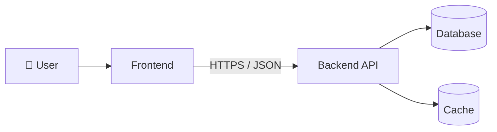

# 🏗️ Architecture

High-level view of how the system is put together. Each layer has its own page with the stack, responsibilities, and boundaries it owns.

<Cards>
  <Card title="🖥️ Frontend" href="/docs/technical/architecture/frontend">
    Client application — rendering, routing, state, and how it talks to the API.
  </Card>
  <Card title="⚙️ Backend" href="/docs/technical/architecture/backend">
    Services, data stores, and the API surface exposed to clients.
  </Card>
</Cards>

## System Context

_Placeholder — replace with the real system context once the stack is fixed._
