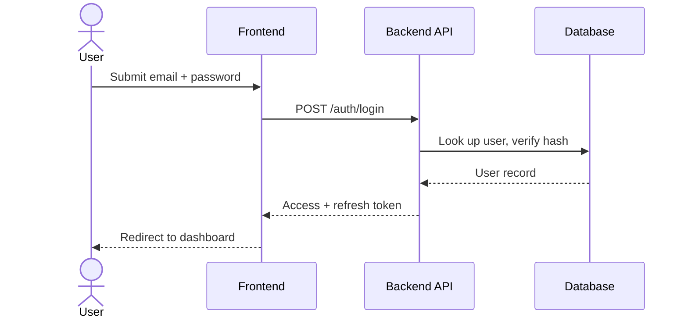

# 🔑 Login Flow

_Placeholder example — use this page as the template for other feature flows._

## Trigger

User submits email + password on the sign-in form.

## Sequence

## Steps

1. **Submit** — frontend validates the shape of the input only; the backend re-validates everything.
2. **Verify** — backend looks up the account and checks the password hash.
3. **Issue session** — on success, access and refresh tokens are issued. See [Session Management](/docs/auth/oauth-sso/session-management) for TTLs and rotation rules.
4. **Redirect** — frontend stores the session and moves the user to the dashboard.

## Failure cases

| Case | Response | What the user sees |
|---|---|---|
| Wrong password | `401` | Generic "invalid credentials" — never reveal which field was wrong |
| Account locked | `423` | Lockout notice — see [Account Lifecycle](/docs/user/rbac-permissions/user-lifecycle) |
| MFA required | `200` + challenge | MFA prompt — see [Multi-Factor Authentication](/docs/auth/login-flow/mfa) |
